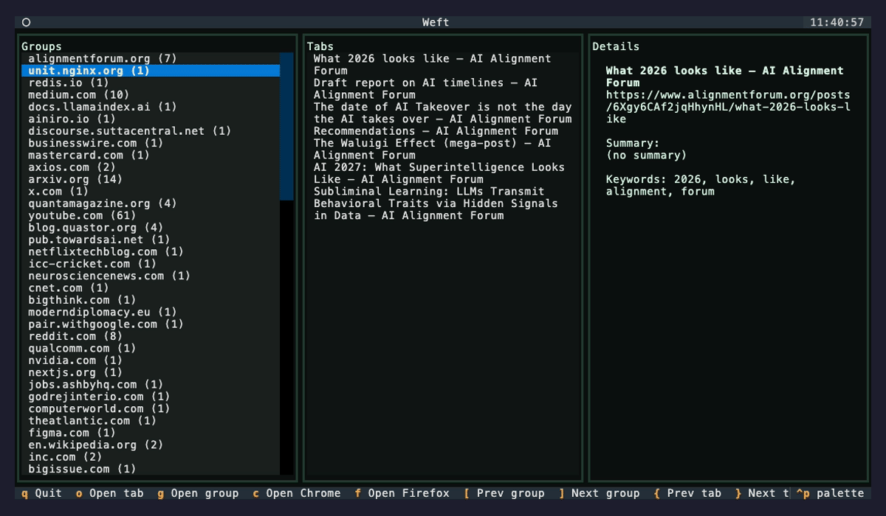

# Weft

A local-first knowledge graph for your browsing.

Weft turns your browser tabs into a searchable, clustered knowledge graph. Instead of drowning in hundreds of tabs or flat bookmark lists, Weft groups related pages, removes duplicates, and lets you explore your browsing context using a fast terminal UI.

**Think:** Obsidian graph view, but for the web you already opened.



## Why Weft?

| Tool | What it does |
|------|--------------|
| OneTab | Saves links in a flat list |
| Bookmarks | Folders you'll never organize |
| **Weft** | Builds memory from your browsing |

## Features

- **Knowledge Graph** - Pages connected by semantic similarity, not folders
- **Automatic Clustering** - Groups related content by meaning and domain
- **Near-Duplicate Detection** - SimHash identifies similar pages across sites
- **Smart Search** - Fuzzy text, keyword (`#topic`), and domain (`@site`) filters
- **Graph Explorer** - Navigate neighbors, discover related content
- **Optional LLM Summaries** - Local AI via Ollama for richer understanding
- **Fully Local** - Your data never leaves your machine

## Install

```bash
pip install weft
```

Or from source:

```bash
git clone https://github.com/yourusername/weft.git
cd weft
pip install -e .
```

## Quick Start

```bash
# Build knowledge graph from your browser tabs
weft weave

# Explore in terminal UI
weft explore
```

## Commands

### `weft weave`

Extracts tabs from browsers and weaves them into a knowledge graph.

```bash
# From all browsers (default)
weft weave

# Chrome only
weft weave --browser chrome

# Firefox only
weft weave --browser firefox

# With LLM summaries (requires Ollama)
weft weave --summarize

# Fast mode (tab titles only, no crawling)
weft weave --no-crawl
```

### `weft explore`

Interactive TUI for exploring your knowledge graph.

```bash
# Default graph
weft explore

# Specific file
weft explore my_graph.json
```

#### Keyboard Shortcuts

| Key | Action |
|-----|--------|
| `[` / `]` | Navigate groups |
| `{` / `}` | Navigate tabs in group |
| `o` | Open tab in browser |
| `g` | Open all tabs in group |
| `v` | Switch to graph view |
| `s` | Focus search |
| `q` | Quit |

**Search syntax:**
- Fuzzy: `distributed systems`
- Keyword: `#performance`
- Domain: `@github`

## How It Works

```
Tabs → Extract → Cluster → Graph → Explore
         │          │         │
         ▼          ▼         ▼
     Keywords   SimHash   Similarity
      TF-IDF    Dedup     Matrix
```

1. **Extract** - Pulls tabs from Chrome/Firefox, optionally crawls page content
2. **Cluster** - Groups by semantic similarity + domain affinity
3. **Deduplicate** - SimHash finds near-identical content across domains
4. **Graph** - Builds similarity edges between related pages
5. **Explore** - Fast TUI for search, navigation, and discovery

## Requirements

- Python 3.9+
- macOS (browser export uses AppleScript)
- Chrome and/or Firefox

### Optional: LLM Summaries

```bash
# Install Ollama
brew install ollama

# Pull models
ollama pull llama3.1:8b
ollama pull nomic-embed-text

# Use with summarization
weft weave --summarize
```

## License

MIT
